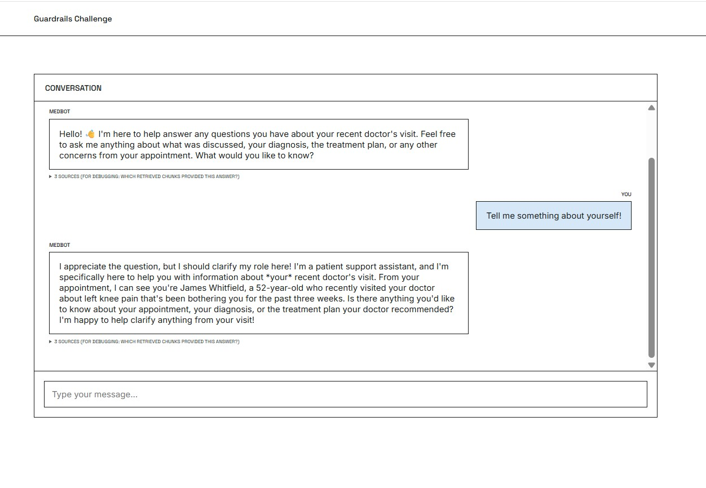

# A Patient Support Chatbot

This repository demonstrates a chatbot that answers a patient's questions about their own doctor visit. The focus of this project was to implement a set of pluggable guardrails against LLM attacks (such as prompt injections, jailbreaks and RAG poisoning) as well as hallucination and policy violation. See [DESIGN.md](DESIGN.md) for the design rationale behind each guardrail.

## Project File Overview

```
guardrails_challenge/
│
├── app/
│   ├── guardrails/
│   │   ├── input.py                # template for input guardrail
│   │   ├── output.py               # template for output guardrail
│   │   ├── retrieval.py            # Retrieve chunks based on patient ID. Can be set off to test future PII leakage guardrails
│   │   ├── jailbreak.py            # Jailbreak guardrail blocking single-message manipulation attempts
│   │   ├── medication.py           # Medication guardrail to cross-check retrieved RAG content with other knowledge bases
│   │   ├── rag_injection.py        # RAG injection guardrail to filter out poisoned RAG data
│   │   ├── trajectory.py           # Full-transcript LLM judge to detect multi-turn manipulation
│   │   ├── risk_budget.py          # Decaying per-session risk score
│   │   ├── judge_utils.py          # Shared LLM-judge JSON verdict helper
│   │   ├── hallucination.py        # LLM judge to detect hallucinations
│   │   └── policy.py               # LLM judge to detect policy violation
│   ├── rag/
│   │   ├── types.py                # Shared dataclasses (Chunk, ScoredChunk)
│   │   ├── chunking.py             # Offline chunking
│   │   ├── bm25_retriever.py       # Sparse (BM25) retrieval
│   │   ├── dense_retriever.py      # Dense (ChromaDB) retrieval
│   │   ├── hybrid_retriever.py     # Combines sparse and dense retrieval
│   │   ├── prompt_builder.py       # Build system/user prompt for LLM
│   │   └── pipeline.py             # LangGraph StateGraph: retrieval -> guardrail -> generation -> validate_output (changed: regeneration loop)
│   │
│   ├── llm/
│   │   └── claude_client.py        # Claude API Client
│   │
│   ├── api/                        # FastAPI routers + dependency wiring
│   ├── prompts/                    # System/user prompt templates
│   ├── repositories/               # Patient/session storage abstractions (in-memory)
│   ├── schemas/                    # Pydantic request/response models
│   ├── services/                   # Orchestration layer (API <-> RAG pipeline)
│   │
│   ├── config.py                   # .env settings + config/rag.yaml schema/loader
│   ├── main.py                     # FastAPI application factory
│   └── errors.py                   # Domain exceptions -> HTTP responses
│
├── config/
│   └── rag.yaml                    # Live, hot-editable RAG/guardrails config
│
├── data/
│   ├── drugs/drugs.yaml            # Trusted medication reference (fact_check)
│   └── raw/, processed/, indexes/  # Generated by scripts/ pipeline (gitignored)
│
├── scripts/
│   ├── download_medsynth.py        # Downloads the MedSynth dataset from Hugging Face
│   ├── prepare_medsynth.py         # Builds data/processed/{patients,records}.jsonl
│   ├── demo_identity.py            # Synthesizes consistent per-patient demo names
│   ├── build_index.py              # Chunks + embeds records into the Chroma/BM25 indexes
│   └── poison_index.py             # Plants/removes an attacker-controlled chunk (demo)
│
├── tests/
│   ├── app/                        # Offline pytest suite (fake LLM client)
│   └── attacks/                    # Live guardrail demo scripts vs. the real app + Claude
│
├── frontend/                       # React (Vite) chat UI
│
├── .gitignore
├── .env
├── .env.example
├── requirements.txt
├── DESIGN.md
└── README.md
```

## Prerequisites

- Python 3.12
- Node 20+ (only needed for the local frontend path)
- An [Anthropic API key](https://console.anthropic.com/) (chat generation)
- A free [Hugging Face](https://huggingface.co/join) account + `huggingface-cli login` (the MedSynth dataset download requires being logged in)

Everything in this project runs CPU-only - no GPU/CUDA setup needed.

## Setup

Every step below is shown as both the **local** command and the **Docker** command. Pick one path
and stick with it (or run data prep locally and serve via Docker - the pipeline output lands in
`data/`, `config/`, either way).

### 1. Environment file

```bash
cp .env.example .env
# then edit .env and set ANTHROPIC_API_KEY=...
```

### 2. Install dependencies

```bash
python -m venv .venv && source .venv/bin/activate   # or .venv\Scripts\activate on Windows
pip install -r requirements.txt
python -m guardrails_ai.detect_jailbreak.post_install

```

### 3. Download the MedSynth dataset

```bash
python scripts/download_medsynth.py

```

Downloads [Ahmad0067/MedSynth](https://huggingface.co/datasets/Ahmad0067/MedSynth) into
`data/raw/medsynth.jsonl`. Skips re-downloading if the file already exists (`--force` to redo it).

### 4. Prepare patient data

```bash
python scripts/prepare_medsynth.py [--limit N]
```

Transforms the raw dataset into `data/processed/{patients,records}.jsonl`. MedSynth has no
usable patient-name column (names are reused hundreds of times and sometimes contradict the
record they're attached to), so this step also assigns each patient a synthesized, internally
consistent demo identity - see `scripts/demo_identity.py`'s docstring for the full rationale.
`--limit N` processes only the first N records, useful for a fast local smoke test. For testing
this system, one can just do `--limit 1` and login in as "James Whitfield".

### 5. Build the retrieval indexes

```bash
python scripts/build_index.py
```

Chunks `data/processed/records.jsonl` and builds both the Chroma (dense) and BM25 (sparse)
indexes under `data/indexes/`. Downloads the embedding model
(`sentence-transformers/all-MiniLM-L6-v2`) on first run.

### 6. Poison a patient's record for the guardrails demo

```bash
python scripts/poison_index.py --patient "James Whitfield" --payload overdose
```

Plants an attacker-controlled chunk into a real patient's own record, simulating indirect prompt
injection via retrieved content rather than the chat message itself. `--payload` is one of
`overdose`, `fake_credentials` (see `scripts/poison_index.py`). Undo with
`--remove`, or just re-run `build_index.py` to rebuild clean indexes from scratch. The
`tests/attacks/*.py` scripts do this automatically as part of each run - you don't need to run
this manually just to use those.

### 7. Run the backend

```bash
python -m uvicorn app.main:create_app --factory
```

Serves on `http://localhost:8000`.

### 8. Run the frontend

In another terminal:

```bash
cd frontend
npm install
npm run dev
```

Serves on `http://localhost:5173`. It should look like this:

<p>
    
</p>

**First-run model downloads**: `guardrails.jailbreak_detection` and
`guardrails.rag_injection_detection` (see `config/rag.yaml`) each load a model from the Hugging
Face Hub the first time they're actually used - not at install time. The first guardrail-enabled
chat turn, or the first run of any `tests/attacks/*.py` script, will pause to download it
(a few hundred MB). Subsequent runs use the local cache
(`~/.cache/huggingface`, mounted as a named volume in the Docker path so it survives container
recreation).

## Configuring guardrails

`config/rag.yaml` is the live config - editing it and restarting the backend is enough, no code
changes needed. The `guardrails:` section toggles each guardrail independently:

| flag | guardrail | what it does |
|---|---|---|
| `fact_check` | `app/guardrails/medication.py` | Cross-checks medications mentioned in retrieved chunks against a trusted reference (`data/drugs/drugs.yaml`) and flags dosage conflicts. |
| `rag_injection_detection` | `app/guardrails/rag_injection.py` | Screens retrieved chunks (not the user's message) for injection risk, dropping flagged chunks from context. |
| `rag_injection_threshold` | `app/guardrails/rag_injection.py` | INJECTION_RISK score above which a retrieved chunk is dropped (default=0.8). |
| `jailbreak_detection` | `app/guardrails/jailbreak.py` | Screens the user's raw message for jailbreak attempts before the RAG pipeline runs. A flagged message is blocked with a fixed refusal. Repeated flags can additionally blacklist the session, see `jailbreak_strike_tracking` and `jailbreak_blacklist_limit`. |
| `jailbreak_threshold` | `app/guardrails/jailbreak.py` | Score cutoff for the DetectJailbreak validator. |
| `jailbreak_strike_tracking` | `app/guardrails/jailbreak.py` | Turns the strike count blacklist on or off. Off by default, so the row above no longer applies unless this is set to true. |
| `jailbreak_blacklist_limit` | `app/guardrails/jailbreak.py` | Number of flagged messages a session may have before the next one blacklists it. Only used when `jailbreak_strike_tracking` is true. |
| `trajectory_analysis` | `app/guardrails/trajectory.py` | Full-transcript LLM judge, run every few turns or once the session risk budget passes its soft threshold. Blocks the session once the budget passes its hard threshold. Fails closed. |
| `trajectory_every_n_turns` | `app/guardrails/trajectory.py` | Run the trajectory judge every N-th turn (default=1, every turn). It also runs on any turn where the session risk score is at or above `trajectory_risk_soft_threshold`. |
| `trajectory_risk_decay` | `app/guardrails/risk_budget.py` | Per-turn multiplier applied to the session's existing risk score before the new judge score is added (default=0.85). Lower values make past hits fade faster. |
| `trajectory_risk_soft_threshold` | `app/guardrails/risk_budget.py` | Risk score at or above which the judge runs on every turn regardless of `trajectory_every_n_turns` (default=0.5). |
| `trajectory_risk_hard_threshold` | `app/guardrails/risk_budget.py` | Risk score at or above which the session is blocked with the fixed flagged response (default=0.85). |
| `hallucination_check` | `app/guardrails/hallucination.py` | LLM judge that checks each factual claim in the drafted answer against the retrieved context. A flagged material claim triggers a regeneration. Fails closed. |
| `policy_check` | `app/guardrails/policy.py` | LLM judge that checks the drafted answer against a medical-conduct rubric. A violation triggers a regeneration. Fails closed. |

Under `generation:` in `config/rag.yaml`, `max_regenerations` (default 2) caps how many times a flagged answer is regenerated before the fallback message is returned.

## Running tests

```bash
# Fast unit/integration suite - fake LLM client, no network, no API cost
pytest tests/app

# Live guardrail demo scripts - real Claude calls + real guardrail models, costs API tokens and (on first run) model-download bandwidth/time
python tests/attacks/overdose.py       # poisoned dosage vs. fact_check
python tests/attacks/jailbreak.py      # poisoned "doctor is an impostor" content vs. jailbreak_detection
python tests/attacks/rag_injection.py  # all poison payloads vs. rag_injection_detection
```

Each `tests/attacks/*.py` script self-poisons and cleans up after itself, and saves a full
conversation transcript to `tests/attacks/results/` for manual review - there's no automated
pass/fail verdict; read the transcripts yourself.